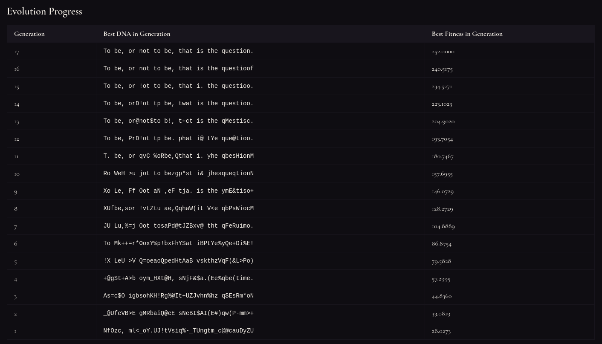
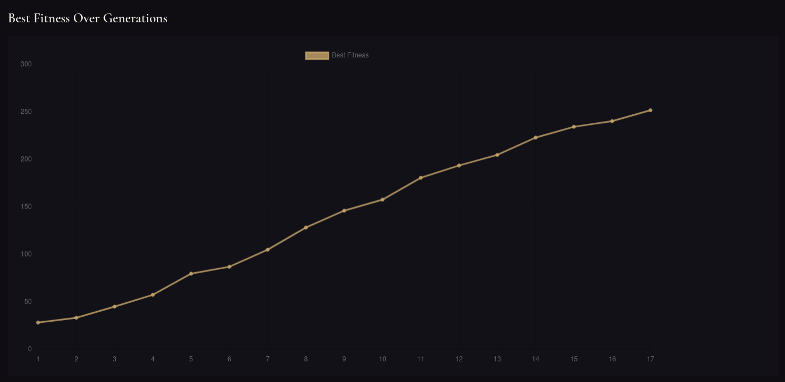
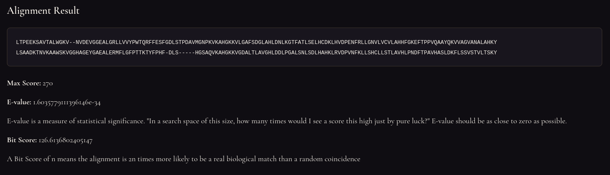
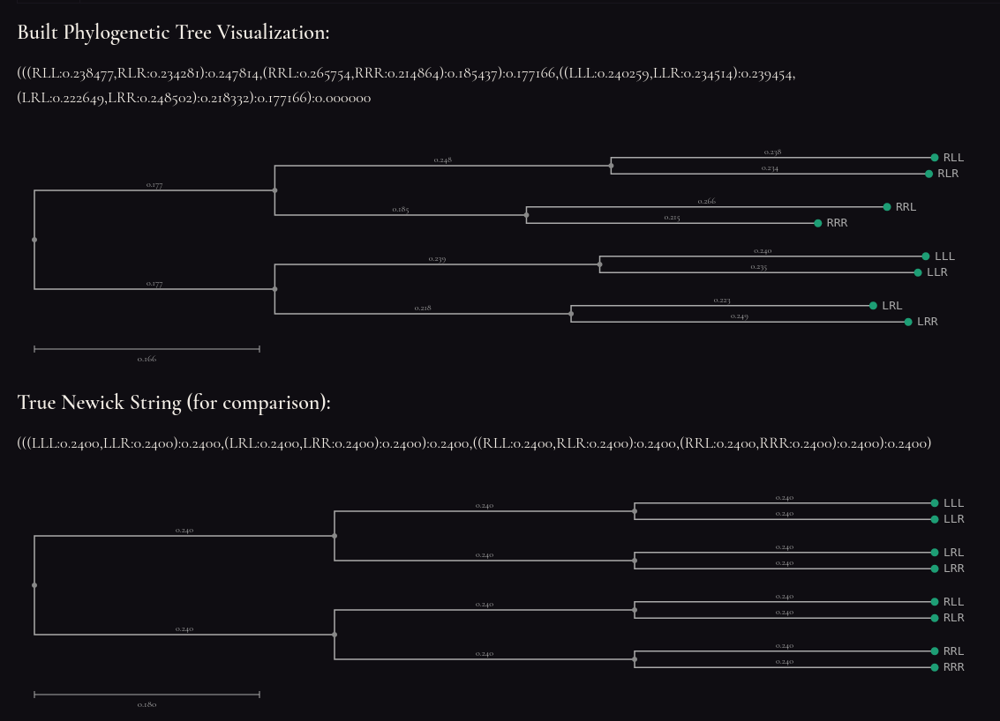

# Evolution Simulation

This repository contains implementations of several algorithms related to evolutionary simulations and sequence alignment theory.

**The algorithms included are:**

- Genetic Algorithm (GA)
- Neighbor-Joining (NJ)
- UPGMA (Unweighted Pair Group Method with Arithmetic Mean)
- Gotoh's Algorithm
- Needleman-Wunsch Algorithm
- Smith-Waterman Algorithm

**Other implementations include:**

- BLOSUM62 scoring matrix
- PAM250 scoring matrix
- Jukes-Cantor distance calculation
- Newick format tree representation
- Stagnation detection and dynamic mutation rate in genetic algorithms
- Affine gap penalties in sequence alignment algorithms

**App:**

- Is built with Vue.js, Express.js and Typescript.
- Protein sequences are taken from [UniProt](https://www.uniprot.org/).

## Results

### Genetic Algorithm

Following image depicts the process of a genetic algorithm trying to guess a predefined target sequence, which is an arbitrary sentence.

Following is the history of the members with the best fitness value in each generation, which shows how the algorithm converges to the target sentence over time.

### Sequence Alignment

Sequence alignment algorithm is used to align the protein sequences of human and horse hemoglobins in the image.

### Complete Simulation

The complete simulation takes a seqeunce as a seed and applies the genetic algorithm to evolve it over time. Then, with the help of the Neighbor-Joining algorithm, a phylogenetic tree is constructed based on the evolved sequences. It is possible to compare this tree with the original tree with the help of the Newick format tree representation.

## Resources

1. [Evolution - Britannica](https://www.britannica.com/science/evolution-scientific-theory)
2. [What is Evolution? - Evrim Agaci](https://evrimagaci.org/evrim-nedir-5509)
3. [Genetic algorithms explained in 6 minutes (...and 28 seconds)](https://youtu.be/-kpcAa-qKwY)
4. [Genetic Algorithms Explained By Example](https://youtu.be/uQj5UNhCPuo)
5. [Genetic Algorithm from Scratch in Python (tutorial with code)](https://youtu.be/nhT56blfRpE)
6. [Genetic Algorithms - GeeksforGeeks (With implementation example)](https://www.geeksforgeeks.org/dsa/genetic-algorithms/)
7. [Genetic Algorithm Example in JavaScript](https://youtu.be/QI3aMRu0JPA)
8. [Genetic Algorithm Tutorial - How to Write Genetic Algorithms in JavaScript](https://youtu.be/RjxwPZcfpAQ)
9. [Ergodic Markov Chains](<https://stats.libretexts.org/Bookshelves/Probability_Theory/Introductory_Probability_(Grinstead_and_Snell)/11%3A_Markov_Chains/11.03%3A_Ergodic_Markov_Chains>)
10. [Sequence Alignment - Michael S. Rosenberg](https://content.ucpress.edu/chapters/10874.ch01.pdf)
11. [Edit Distance Between 2 Strings - The Levenshtein Distance ('Edit Distance' on LeetCode)](https://youtu.be/MiqoA-yF-0M)
12. [Sequence alignment - Wikipedia](https://en.wikipedia.org/wiki/Sequence_alignment)
13. [The Phylogenetic Handbook](https://isu-molphyl.github.io/EEOB563/chapter3.pdf)
14. [ClustalW - Multiple Sequence Alignment by Kyoto University Bioinformatics Center](https://www.genome.jp/tools-bin/clustalw)
15. [Sequence Alignment - Michael S. Rosenberg](https://content.ucpress.edu/chapters/10874.ch01.pdf)
16. [BLAST 5 BLOSUM62 - Rob Edwards](https://youtu.be/njva17LwhsE)
17. [Construction of Substitution Matrices: Part 1 - BLOSUM](https://bioinformaticshome.com/learn/tutorials/sequence-alignment/substitution-matrices#gsc.tab=0)
18. [BLOSUM - Wikipedia](https://en.wikipedia.org/wiki/BLOSUM)
19. [BLOSUM62 in JSON format](https://gist.github.com/camillescott/403d2229d25ce30c94c3)
20. [UniProt](https://www.uniprot.org/)
21. [Week 2.2.2 Alignment with Affine Gap Penalty and Calculation of Time Complexity of The Needleman Wun](https://youtu.be/DQQ_q2dn2ds)
22. [1: Introduction to Gotoh's Alignment Algorithm](https://youtu.be/VzR5wyf5sD0)
23. [2: Memoization in Gotoh's Algorithm](https://youtu.be/tTRR-nZLR6I)
24. [PAM and BLOSUM Matrices](https://www.biogem.org/downloads/notes/kau/PAM%20and%20BLOSUM%20Matrices.pdf)
25. [4.3 - Interpreting BLAST results - E-Value and Bit Score](https://genomicsaotearoa.github.io/hts_workshop_mpi/level1/43_blast_interpretation/#interpretting-the-results-of-blast-queries)
26. [Evrimde Türler Arası Benzerlikler ve Köken İlişkisi: Homoloji Nedir? Homoplazi Nedir?](https://evrimagaci.org/evrimde-turler-arasi-benzerlikler-ve-koken-iliskisi-homoloji-nedir-homoplazi-nedir-1973)
27. [Evrim Ağaçlarının (Filogenetik Haritaların) Özü: Canlılık Tarihini Haritalamanın Bilimi](https://evrimagaci.org/evrim-agaclarinin-filogenetik-haritalarin-ozu-canlilik-tarihini-haritalamanin-bilimi-3175)
28. [Phylogenetic Tree - Wikipedia](https://en.wikipedia.org/wiki/Phylogenetic_tree)
29. [Newick Format - Wikipedia](https://en.wikipedia.org/wiki/Newick_format)
30. [Phylogenetic Tree - Sciencefacts](https://www.sciencefacts.net/phylogenetic-tree.html)
31. [Phylogenetic Trees - Biological Principles](https://bioprinciples.biosci.gatech.edu/module-1-evolution/phylogenetic-trees/)
32. [Distance Estimation - MEGA Manual](https://www.megasoftware.net/mega1_manual/Distance.html)
33. [Substitution Models - Wikipedia](https://en.wikipedia.org/wiki/Substitution_model)
34. [ETE Toolkit Phylogenetic Tree Viewer](https://etetoolkit.org/treeview/)
35. [Distance Algorithms: UPGMA and Neighbor-Joining](https://cs.brown.edu/courses/csci1810/fall-2024/lectures/Phylogeny.pdf)
36. [UPGMA - Wikipedia](https://en.wikipedia.org/wiki/UPGMA)
37. [Creating a Phylogenetic Tree - Oxford Academic](https://youtu.be/09eD4A_HxVQ)
38. [Time Tree](https://timetree.org/)
39. [The Neighbor-Joining Algorithm](https://youtu.be/Y0QWFFWQzds)
40. [Phylogeny based on differences in the protein sequence of cytochrome c.](https://cdn.britannica.com/03/403-050-F1B9349F/Phylogeny-differences-cytochrome-c-protein-sequence-organisms.jpg)

### Further reading about GA

41. Applegate, D. L., Bixby, R. E., Chvátal, V., & Cook, W. J. (2006). _The traveling salesman problem: A computational study_. Princeton University Press.
42. Colorni, A., Dorigo, M., & Maniezzo, V. (1992). A genetic algorithm to solve the timetable problem. Technical Report 90-060, Politecnico di Milano.
43. Darwin, C. (1859). _On the origin of species by means of natural selection_. John Murray.
44. Davis, L. (Ed.). (1991). _Handbook of genetic algorithms_. Van Nostrand Reinhold.
45. [Encyclopaedia Britannica. (2024). DNA.](https://www.britannica.com/science/DNA)
46. [Eremeev, A. V. (2020). Runtime analysis of non-elitist evolutionary algorithms with fitness-proportionate selection on royal road functions. In Proceedings of the 2020 Cognitive Sciences, Genomics and Bioinformatics (CSGB) (pp. 228–232). IEEE.](https://doi.org/10.1109/CSGB51356.2020.9214612)
47. Futuyma, D. J., & Kirkpatrick, M. (2017). _Evolution_ (4th ed.). Sinauer Associates.
48. Holland, J. H. (1992). _Adaptation in natural and artificial systems: An introductory analysis with applications to biology, control, and artificial intelligence_. MIT Press.
49. Kellerer, H., Pferschy, U., & Pisinger, D. (2004). _Knapsack problems_. Springer.
50. Lohn, J. D., Hornby, G. S., & Linden, D. S. (2005). An evolved antenna for deployment on NASA’s Space Technology 5 mission. In Proceedings of the AIAA Space 2005 Conference. IEEE.
51. Mitchell, M. (1998). _An introduction to genetic algorithms_. MIT Press.
52. Syswerda, G. (1989). Uniform crossover in genetic algorithms. In J. D. Schaffer (Ed.), Proceedings of the 3rd International Conference on Genetic Algorithms (pp. 2–9). Morgan Kaufmann.
